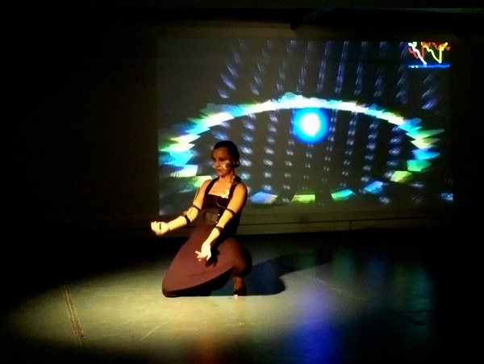
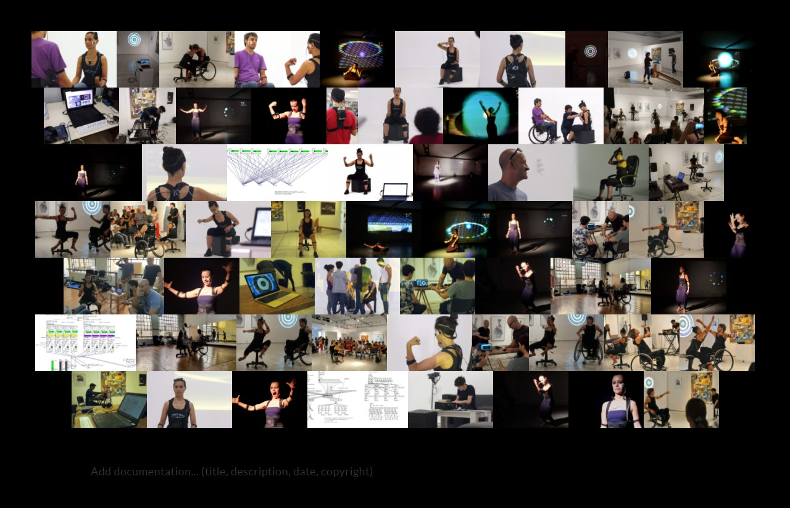

## FUSIÓN 2020 - WIMUMO: El impulso neuromuscular como experiencia

---

<button onclick="window.location.href='https://gibic-leici.github.io/wimumo/';">
Noviembre Electrónico
</button>
<button onclick="window.location.href='https://gibic-leici.github.io/wimumo/quees';">
¿Qué es WIMUMO?
</button>
<button onclick="window.location.href='https://gibic-leici.github.io/wimumo/presentaciones';">
Presentaciones anteriores
</button>

---

Varias señales eléctricas denominadas biopotenciales habitan y recorren el cuerpo, como el conocido electrocardiograma del corazón o el electromiograma proveniente de los músculos. Estos biopotenciales pueden capturarse con WIMUMO; la funcionalidad de este equipo es análoga a la de un instrumento musical, o multimedia, que puede ejecutarse a través de la medida de estos biopotenciales, enviando el contenido audiovisual generado a partir de las mismas por internet. El cerebro ejerce un control parcial sobre estas señales, ya que se vinculan también a procesos involuntarios que ocurren en el cuerpo, a estados físicos y de ánimo. Son en parte determinísticas y en parte aleatorias, por lo tanto, como instrumento, WIMUMO tiene la particularidad de reflejar estados voluntarios e involuntarios de la persona que lo usa y dar acceso a su “mundo interno”.

\
*Uso de WIMUMO en obra de SPEAKINTERACTIVE Imaginación Colectiva*

A partir de la colaboración de profesionales de la ingeniería, la música, el diseño multimedia, y la performance, las señales de biopotencial pueden traducirse en sonidos, imágenes y vibraciones. Esto permite experimentarlas sinestésicamente en tiempo real, estableciendo una conexión directa y descarnada con el artista o con su propio mundo interior.

Los períodos de cuarentena dieron lugar a nuevas formas de comunicación, que existían, pero no eran utilizadas masivamente. Las herramientas de teleconferencia, que permiten ver y oír a las personas, habilitaron un nivel de comunicación que no hubiese sucedido años atrás. Aun así, la sensación de aislamiento y falta de contacto con seres queridos fue generalizada. ¿Por qué no sentimos la cercanía de las personas, si dos de nuestros sentidos las captan? ¿Por qué este fragmento de la persona no es suficiente? ¿hay algo de la calidez o la esencia de una persona que se transmita por estos medios, o sería lo mismo una mera simulación o artefacto digital?

El proyecto propone entonces usar WIMUMO para captar señales internas, esa confluencia de voluntad, cuerpo e inconsciente que quizás nutra un semblante que podamos sentir más próximo; pero sólo será posible si el arte, de manera interdisciplinaria, aporta los medios para transmitir esta información, convertirla en sensaciones, en vivencias, en una envoltura cálida que abrace con la sustancia de la persona como si su piel, aroma, roces, sonidos, gestualidad y la infinita riqueza de su presencia estuviesen, presentes. 

\
