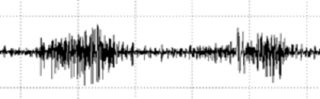
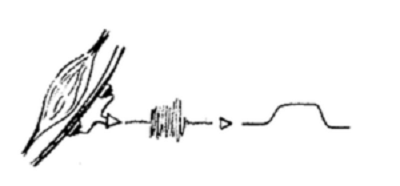

## Adquisición de biopotenciales multi-modal inalámbrica 

<button onclick="window.location.href='https://gibic-leici.github.io/wimumo/presentaciones';">
Presentaciones
</button>

WIMUMO es un dispositivo inalámbrico capaz de medir las señales eléctricas del cuerpo. La señal electro-fisiológica o biopotencial  más conocida se ve en el electrocardiograma (ECG) que casi todas las personas se han hecho alguna vez, pero pueden medirse otras como las provenientes de los músculos (llamado electromiograma o EMG), cerebro (EEG), ojos (EOG).

\
*Señal de Electrocardiograma (ECG)*

WIMUMO  mide estas señales, las transmite en forma inalámbrica a través de la red WiFi, y las aprovecha para producir música, jugar juegos y aprender sobre las propias señales visualizándolas. Técnicamente la llamamos Plataforma de Adquisición Multi Modal, y de ahí su nombre (en inglés WIreless MUlti MOdal aqcuisition platform).

\
*Foto del primer prototipo de WIMUMO*

WIMUMO no está pensado sólo para ser usado por los ingenieros que lo desarrollaron, sino que uno de sus objetivos es proveer acceso simple y amigable a las señales producidas en el cuerpo humano.

El poder motivador de las señales de biopotenciales en conjunto con un fácil acceso posibilita la generación de múltiples aplicaciones para docencia, performances artísticas, entretenimiento, dispositivos de asistencia a personas en situación de discapacidad y muchas otras.

Por eso WIMUMO pone a disponibilidad las señales, aplicaciones y herramientas de configuración a través de una página web. En el caso de las performances artísticas, se transmiten las señales ya procesadas para generar música e imágenes con programas estándar que habitualmente utilizan músicos y diseñadores multimedia, usando el protocolo OSC.

WIMUMO es un proyecto en desarrollo y en el momento presente se cuenta con dos prototipos que representan las versiones 0.1 y 0.2. Se está desarrollando en el GIBIC (LEICI) la versión 0.4 que será la primera con todos los elementos completos y permitirá su uso sin la asistencia de sus “creadores”, aunque estas tareas se vieron retrasadas por la pandemia.

### Señales eléctricas del cuerpo o “biopotenciales”

Para que podamos contraer un músculo es necesaria una cadena de eventos que comienza con nuestra decisión consciente, o un comando inconsciente, que se dispara en el cerebro, en algunas de nuestras neuronas. Esa “chispa” se transmite a través de nuestro sistema nervioso en forma de un impulso eléctrico llamado “potencial de acción” que viaja hasta los músculos. La señal eléctrica se propaga por los músculos al tiempo que estos se contraen, y si necesitamos hacer más fuerza, se envían cada vez más de estos potenciales.

El corazón es un gran músculo y tiene su propio “marcapasos” que genera estos potenciales de acción al ritmo del latido y le da esa forma tan particular al ECG. El electromiograma (EMG) en cambio, que proviene del proceso descripto anteriormete al moverse o intentar mover los músculos, es menos conocido y su forma es más extraña. Se compone de la superposición de muchos potenciales de acción que corren por nervios y fibras musculares, y por lo tanto se ve como un conjunto de “púas” que crece a medida que realizamos más esfuerzo. Los músculos de brazos, piernas, rostro, etc, reciben estas señales según nuestra voluntad y mueven el cuerpo. Todo esto nos mantiene con vida y nos permite trabajar, comer, jugar, bailar.

\
*Imagen de una señal de electromiograma (EMG)*

\
*Un electrodo “activo” colocado en el atebrazo para medir las señales de los músculos que mueven los dedos*

Cuando los biopotenciales son muy fuertes o pasan muy cerca de la piel, pueden captarse colocando electrodos apoyados en la superficie de la piel. Los electrodos “traducen” los biopotenciales del interior del cuerpo en señales electrónicas que pueden medirse con instrumentos de precisión electrónicos. Justamente el grupo GIBIC del Instituto LEICI (dependiente de la UNLP y CONICET) trabaja en la investigación de estos instrumentos electrónicos que miden biopotenciales, un área donde la ingeniería electrónica y en computación aportan a la ingeniería biomédica.

### De la medida de biopotenciales a la música

Para utilizar los biopotenciales en performances u obras artísticas de cualquier tipo, WIMUMO mide las señales musculares y cardíacas, y las procesa digitalmente para obtener la “actividad promedio” observada en cada señal, conocida como envolvente. Esta envolvente es una indicación clara de la fuerza realizada con uno o varios músculos. WIMUMO la envía a programas de generación de música o video y entonces, por ejemplo, puede usarse para subir o bajar el volumen de una nota musical. De esa manera, cuando una persona en una performance se mueve, o, estando inmóvil, realiza esfuerzo con sus músculos, puede crear distintos sonidos.

\
*Se mide la señal de EMG y se obtiene la “envolvente” que representa el esfuerzo*

\
*Una visión “técnica” de la obtención de la envolvente*