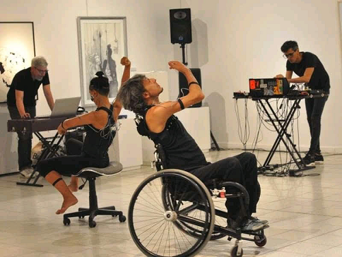

## Eventos donde se utilizó WIMUMO

[Noviembre Electrónico | ](https://gibic-leici.github.io/wimumo)
[¿Qué es WIMUMO? | ](https://gibic-leici.github.io/wimumo/quees)
[Presentaciones anteriores](https://gibic-leici.github.io/wimumo/presentaciones)

---

### Performance en el Museo Pettoruti

Demian Frontera y Alejandra Ceriani serán los performers sobre los que se instalará WIMUMO: un dispositivo para captura de biopotenciales desarrollado por el GIBIC que transmitirá sus biopotenciales por WIFI a dos computadoras. En una de ellas Alejandro Veiga generará sonidos a partir de estas señales y en la otra Tobías Albirosa producirá imágenes dinámicas. Al mismo tiempo, Gabriel Drah compondrá música en vivo a partir del contenido audiovisual presente en escena. WIMUMO es un proyecto en continuo desarrollo por parte de los integrantes del GIBIC: Federico Guerrero, Marcelo Haberman, Pablo García, Enrique Spinelli, Alejandro Veiga, Valentín Catacora, Rocío Madou, Matías Oliva y Rodolfo Di Salvo.

\
*Demian Frontera (al frente), Alejandra Ceriani (a su izquierda), Gabriel Drah (fondo a la derecha) y Alejandro Veiga (fondo a la izquierda)*